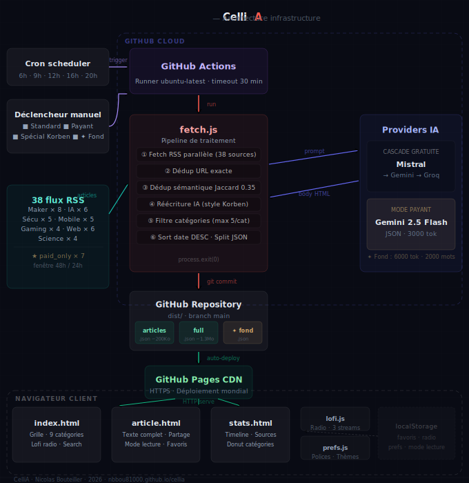

# 🤖 CelliA — 100% Autonomous Tech & Tinkering Media

> **Discover the live site:** [👉 Access CelliA](https://nbbou81000.github.io/cellia/) 

---

## 💡 The Concept
**CelliA** is an entirely automated technical media experiment, running smoothly with no database, no paid servers, and zero daily human maintenance. 

The site auto-updates **5 times a day** by scouting for gems across English and French tech communities (Hacker News, r/selfhosted, r/LocalLLaMA, independent blogs). It then leverages the power of LLMs to translate, summarize, and craft articles of around 300 words with a curious, geeky tone.

To top it all off, it features a **built-in Lofi Radio** with a mini-player to accompany your reading sessions.

---

## 🛠️ The Architecture (How to run at €0 / $0)

This project is carefully designed to strictly respect GitHub's Fair Use limits, proving that you can build and deploy a production-ready autonomous AI agent completely for free:

*   **Infrastructure:** 100% [GitHub Pages](https://pages.github.com/) for fast, static hosting.
*   **Orchestration:** A [GitHub Actions](https://github.com/features/actions) workflow (`cron`) triggers 5 times a day to run the scraping and generation script. Each job takes about 5 minutes to complete.
*   **Multi-API Resilience (Fallback System):** To bypass the strict rate limits of free tiers, the script implements a smart cascading fallback chain:
    $$\text{Groq} \longrightarrow \text{Mistral AI} \longrightarrow \text{Google Gemini}$$
    If an API gets rate-limited or fails, the next one automatically takes over to ensure the article gets published.

### ⚙️ Advanced Workflow Options
The GitHub Actions workflow also includes optional toggles:
*   **Paid API Mode:** A simple toggle to switch to paid API tiers in order to scrape more sources and generate longer content.
*   **Deep-Dive Article Mode:** An option to generate comprehensive, in-depth technical long-forms utilizing up to 6,000 tokens.

---

## 📻 Key Features
*   **Targeted Scraping:** Monitors over 20 high-quality sources focused on software tinkering, home automation, self-hosting, and AI.
*   **Optimized AI Writing:** Generates condensed, crystal-clear articles free of useless fluff or corporate jargon.
*   **Cosy Lofi Player:** 
    *   `🎙️ Radio` button to instantly stream music in the background (perfect for mobile).
    *   `📻 Player` button to toggle a modern, minimalist mini-player widget (Desktop).
    *   Persistent state (via `localStorage`) so your audio preferences stick around between sessions.
    *   Built-in backup streams (*Open.FM Lofi* & *I Love Radio*).

---

## 🔒 Security & Deployment

While the repository and code are completely public, all API keys used for content generation are tightly secured using **GitHub Actions Secrets** (`MISTRAL_API_KEY`, `GROQ_API_KEY`, `GEMINI_API_KEY`). 

## Architecture

-----------------------------------------------------------------------------------------------------------------------------------------------------------------------

-----------------------------------------------------------------------------------------------------------------------------------------------------------------------

-----------------------------------------------------------------------------------------------------------------------------------------------------------------------

# 🤖 CelliA — Média Tech & Bidouille 100% Autonome

> **Découvrir le site en direct :** [👉 Accéder à CelliA](https://nbbou81000.github.io/cellia/) 

---

## 💡 Le Concept
**CelliA** est une expérience de média technique entièrement automatisé, sans base de données, sans serveur payant, et sans maintenance humaine quotidienne. 

Le site s'auto-alimente **5 fois par jour** en allant dénicher des pépites sur le web anglophone et francophone (Hacker News, r/selfhosted, r/LocalLLaMA, blogs indépendants), puis utilise la puissance des LLM pour traduire, synthétiser et rédiger des articles de ~300 mots au ton "geek et curieux".

Le tout inclut une **Radio Lofi intégrée** avec mini-lecteur pour accompagner vos lectures.

---

## 🛠️ L'Architecture (Ou comment tourner à 0 €)

Ce projet est conçu pour respecter scrupuleusement les limites d'usage équitable (*Fair Use*) de GitHub et prouve qu'on peut créer un agent IA autonome de production de manière totalement gratuite :

*   **Infrastructure :** 100% [GitHub Pages](https://pages.github.com/) pour l'hébergement statique et performant.
*   **Orchestration :** Un workflow [GitHub Actions](https://github.com/features/actions) (`cron`) se déclenche 5 fois par jour pour exécuter le script de scraping et de génération. Le job prend environ 5 minutes par exécution.
*   **Résilience Multi-API (Le Fallback) :** Pour contourner les limitations de requêtes (*Rate Limits*) des forfaits gratuits, le script utilise un système de cascade intelligent :
    $$\text{Groq} \longrightarrow \text{Mistral AI} \longrightarrow \text{Google Gemini}$$
    Si une API sature ou échoue, la suivante prend automatiquement le relais pour garantir la publication de l'article.
Option à cocher dans les github actions pour utiliser une API payante afin de scrapper plus de sources et écrire des articles plus longs.
Autre option pour écrire un article de fond, avec utilisation de 6000 tokens.
---

## 📻 Fonctionnalités Clés
*   **Scraping ciblé :** Analyse de plus de 20 sources axées bidouille logicielle, domotique, auto-hébergement et IA.
*   **Écriture IA optimisée :** Génération d'articles condensés, clairs et sans jargon inutile.
*   **Lecteur Lofi Cosy :** 
    *   Bouton `🎙️ Radio` pour lancer la musique en tâche de fond (idéal sur mobile).
    *   Bouton `📻 Player` pour afficher un mini-lecteur moderne et discret (Desktop).
    *   État persistant (via `localStorage`) pour retrouver sa musique d'une session à l'autre.
    *   Flux de secours intégrés (*Open.FM Lofi* & *I Love Radio*).

---

## 🔒 Sécurité & Déploiement

Le code est entièrement public, mais les clés d'API utilisées pour la génération de contenu sont sécurisées de manière étanche via les **GitHub Actions Secrets** (`MISTRAL_API_KEY`, `GROQ_API_KEY`, `GEMINI_API_KEY`). 

---

## ⭐ Soutenir le projet
Si vous aimez l'idée ou si vous vous inspirez de cette architecture pour vos propres projets, n'hésitez pas à laisser une **étoile (Star)** sur ce dépôt, ça fait toujours plaisir !

*Développé avec passion par un passionné de bidouille.*
